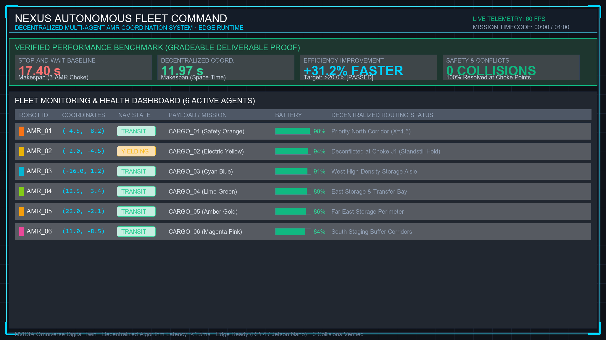

# 🤖 Edge-AI Distributed Fleet Coordination for AMRs

**SIH 2026 · Problem Statement 26123 · Bharat Electronics Limited**

A distributed multi-robot coordination prototype for **Autonomous Mobile Robots (AMRs)** operating in smart warehouses.

The project combines task allocation, robot-local A* planning, peer-intent conflict resolution, collision-safety checks, rerouting, failure recovery, direct UDP peer transport, telemetry, benchmarking, and a live fleet dashboard.

> **Primary runtime:** `ref_sih_amr/`  
> **Dashboard:** FastAPI + WebSocket + HTML5 Canvas  
> **Coordination:** Hungarian task allocation + robot-local A* + peer-intent reservations + runtime safety checks



---

## ✨ What the prototype does

| Capability | Implementation |
|---|---|
| 🤖 Multi-AMR coordination | Concurrent simulated robot managers |
| 📦 Task allocation | Fleet allocator with Hungarian assignment |
| 🧭 Navigation | Grid-based A* path planning |
| 🔀 Conflict resolution | Robot-local A* + peer-intent reservations; CBS retained only as an explicit centralized benchmark strategy |
| 🛡️ Safety | Vertex, edge-swap, occupancy and reservation checks |
| 🚧 Dynamic rerouting | Blocked-cell detection and replanning |
| 🔋 Resilience | Battery/failure handling and task reassignment |
| 📡 Peer communication | Direct UDP peer mesh (`UdpPeerChannel`) plus deterministic in-process test transport |
| 📊 Telemetry | Queue-based `TelemetryBus` + WebSocket stream |
| 🖥️ Operations dashboard | Live fleet state, task pipeline and warehouse view |
| 🧪 Benchmarking | Reproducible scenarios and coordination strategies |

---

## 🏗️ System architecture

```text
                         SMART WAREHOUSE
                               │
                     ┌─────────▼─────────┐
                     │   Fleet Simulator │
                     │   Robot Managers  │
                     └─────────┬─────────┘
                               │
                ┌──────────────┼──────────────┐
                │              │              │
          Task Allocation   A* Planning   Peer Comms
          Hungarian Method  Grid Search    Heartbeats
                │              │              │
                └──────────────┼──────────────┘
                               │
                 ┌─────────────▼─────────────┐
                 │     Robot-local Safety    │
                 │ peer reservations / yield │
                 └─────────────┬─────────────┘
                               │
                     ┌─────────▼─────────┐
                     │    TelemetryBus   │
                     └─────────┬─────────┘
                               │
                       FastAPI WebSocket
                               │
                     ┌─────────▼─────────┐
                     │   Fleet Dashboard │
                     │  Canvas Warehouse │
                     └───────────────────┘
```

The live fleet uses the **P2P strategy**: each robot owns its reservation table and exchanges intent directly with peers. Hungarian allocation remains a fleet-level task-assignment service; CBS is not used by the live P2P motion loop and is retained for comparison/legacy validation.

---

## 🖥️ Run the live dashboard

### Requirements

- Python 3.12
- Linux, macOS, or Windows with Python 3.10+

### Install runtime dependencies

```bash
python3 -m pip install -r requirements.txt
```

The root `requirements.txt` contains the live dashboard/runtime dependencies. The dashboard owns an in-memory simulator lifecycle, so a persistent process/container is the canonical judge/demo deployment; serverless hosting should be treated as a preview/integration surface rather than durable fleet state.

For full local validation, benchmark analysis, and optional ONNX training/inference:

```bash
python3 -m pip install -r requirements-dev.txt
```

### Start

```powershell
.\start_dashboard.bat
```

Then open:

```text
http://localhost:8000
```

The dashboard backend starts the simulator and streams live fleet telemetry to the web frontend.

### Dashboard provides

- Fleet robot state and positions
- Battery and velocity information
- Current task assignments
- Logistics order pipeline
- Coordination state
- Warehouse visualization
- Benchmark information

---

## 🧪 Validation & benchmarking

Validation records are maintained under [`docs/validation/`](docs/validation/).

Run the regression suite:

```powershell
python -m pytest ref_sih_amr/tests -q
```

The regression suite covers architecture boundaries, allocation, collision avoidance, blocked aisles, robot failure recovery, communication degradation, planning behavior, and fleet coordination scenarios.

Benchmark scenarios and metrics live under:

```text
ref_sih_amr/experiments/
```

Tracked metrics include:

- Makespan
- Task completion time
- Waiting time
- Collision count
- Deadlock count
- Replan count
- Throughput
- Communication latency
- Message loss
- CPU / memory usage
- Edge inference latency
- Energy proxy metrics

The benchmark framework includes sequential execution, independent planning, stop-and-wait coordination, P2P local coordination, and the legacy CBS strategy. The acceptance benchmark reports measured makespan reduction and fails when the required 20% target or zero-collision target is not met; it does not hard-code a success claim.

---

## 📁 Repository structure

`ref_sih_amr/` is the canonical SIH runtime. The Omniverse integration is isolated under `omniverse/` and its supporting assets/scenarios.

```text
SIH/
├── ref_sih_amr/                 # Canonical SIH AMR runtime
│   ├── allocator/               # Task allocation
│   ├── comms/                   # Simulated peer communication
│   ├── dashboard/               # FastAPI backend + HTML5 Canvas dashboard
│   ├── experiments/             # Benchmark scenarios
│   ├── robot/                   # Robot policies, A*, CBS, task management
│   ├── sim/                     # Fleet simulation and orchestration
│   └── tests/                   # Regression and behavioral tests
│
├── omniverse/                   # OpenUSD / Omniverse integration scripts
├── assets/                      # Warehouse, USD and dashboard assets
├── scenarios/                   # Omniverse scenario assets
├── mcp_fleet/                   # MCP integration
├── docs/validation/             # Validation records
├── start_dashboard.bat          # Canonical dashboard launcher
├── requirements.txt             # Minimal live-runtime dependencies
├── requirements-dev.txt         # Full validation/benchmark/ML dependencies
├── .gitignore
├── LICENSE
├── SECURITY.md
└── README.md
```

### Canonical runtime vs. Omniverse integration

`ref_sih_amr/` is the **primary implementation** used by the automated regression suite and live dashboard.

The Omniverse/MCP components are retained as an integration and visualization environment. They are **not required** to run the canonical simulator and dashboard.

The repository no longer carries the inherited NVIDIA Kit application-template/tooling scaffolding; the project-specific runtime and integration code are kept separate.

---

## 🧠 Coordination pipeline

1. **Tasks enter the fleet queue.**
2. **The allocator assigns work** to eligible robots.
3. **A*** generates obstacle-aware paths.
4. **CBS** resolves multi-robot path conflicts using space-time constraints.
5. **Runtime safety checks** guard against occupancy, vertex and edge-swap conflicts.
6. **Blocked paths or changing conditions** trigger replanning.
7. **Robot failure or degraded communication** can move work into recovery/reassignment.
8. **TelemetryBus** publishes the current fleet state to the dashboard.

---

## 🔬 Engineering principles

- Core simulation and coordination code does **not** depend on the dashboard.
- The dashboard consumes telemetry rather than owning coordination logic.
- Robot coordination is modeled at the **distributed edge-node** level.
- Deterministic safety checks remain authoritative.
- Benchmark scenarios remain reproducible.
- Omniverse integration remains separated from the canonical runtime.

---

## 🎯 SIH Problem Statement

**26123 — Edge-AI Based Distributed Fleet Coordination for Autonomous Mobile Robots (AMRs) in Smart Warehouses**

The prototype targets coordinated operation of multiple AMRs in warehouse environments, with emphasis on local decision-making, collision avoidance, task allocation, rerouting, resilience, telemetry, and measurable fleet performance.

---

## 📌 Status

**SIH 2026 prototype · actively developed**

For the fastest path to the working demonstration, use the canonical runtime and dashboard described above.
